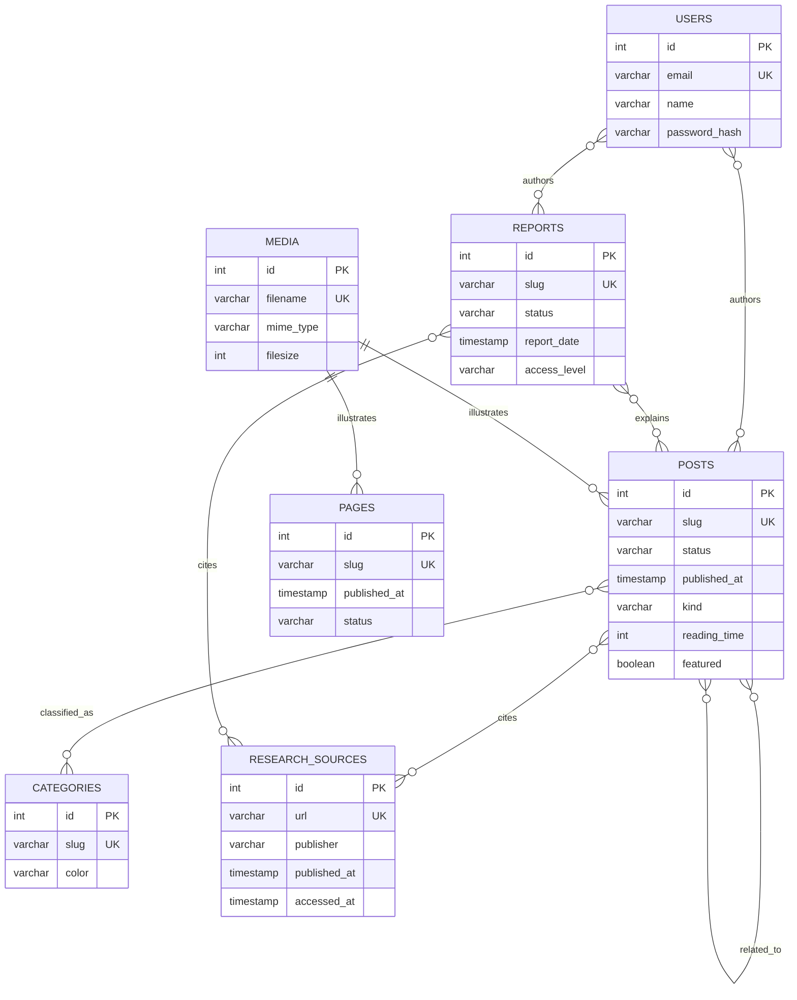

# Trigenys Insights database model

This document describes the logical editorial model and how Payload CMS maps it to PostgreSQL. It is intentionally smaller than the physical schema: editors work with eight main collections, while Payload expands localized content, drafts, blocks, relationships, plugins, and its own runtime state into 92 tables.

`NEWSLETTER_SUBSCRIBERS` is deliberately isolated from editorial authorship. Its email is unique, and `locale` and `status` are indexed for segmented sends. `consented_at` records the latest explicit subscription consent.

## Physical mapping

The 92 PostgreSQL tables are grouped as follows:

- 26 live editorial tables for articles, reports, pages, categories, media, subscribers, localized fields, content blocks, and relationship rows.
- 18 version tables prefixed with `_pages_v`, `_posts_v`, or `_reports_v`; these preserve drafts, autosaves, and scheduled publication state.
- 32 plugin tables for forms, form submissions, redirects, and search.
- 10 Payload runtime tables for migrations, jobs, preferences, document locks, folders, and key-value state.
- 6 global navigation tables for the header and footer.

Payload stores many-to-many fields in `*_rels` tables. The `path` column identifies which relationship a row represents: authors, categories, cited sources, related posts, and so on. Localized text lives in `*_locales`, with a unique `(locale, parent_id)` index. Drafts and published documents share the live collection table; version history lives in the corresponding `_..._v` tables.

## Integrity and indexes

The generated schema currently has 129 foreign keys and 396 indexes. Relationships use foreign keys with `CASCADE` for owned relationship rows and `SET NULL` for optional media references. The database enforces unique article, report, page, and category slugs; unique editor and subscriber emails; unique media filenames; and a unique canonical URL for each research source.

The application requires at least one author and one category for every article, and at least one author for every report. Payload validates these required relationship fields before writing. PostgreSQL then enforces the validity of each stored relation through foreign keys.

The main publication query filters by `_status` and sorts by `published_at`. A compound B-tree index on `(_status, published_at)` supports that access path. Reports have the equivalent `(_status, report_date)` index. Research-source access dates and newsletter locale/status fields are individually indexed.

## Triggers and application hooks

There are currently **zero custom PostgreSQL triggers**. That is deliberate for v1. Payload owns the write path and already provides application hooks for:

- setting `publishedAt` when an article is first published;
- refreshing Next.js pages after publication, unpublication, or deletion;
- exposing public author names without exposing private user records.

Those operations involve application behavior and cache invalidation, so a database trigger would not replace them cleanly. Database triggers become justified if another service starts writing directly to PostgreSQL, or if an append-only audit trail must remain valid independently of Payload.

## CTEs, views, and analytical data

A CTE is a query composition tool, not a persistent part of the schema. The v1 CMS does not need a permanent CTE, view, or materialized view. PostgreSQL and Payload can use CTEs later for report generation, ranking calculations, deduplication, and bulk editorial queries.

The future research platform should add separate normalized entities such as `datasets`, `observations`, `methodologies`, `countries`, `roles`, `currencies`, and `score_runs`. Reproducible scores belong in that server-side analytical layer with method versions and source observations. They should not be hidden in React components or mixed into narrative article tables.

## Access model

The public site and Payload admin connect server-side; the browser never receives a PostgreSQL connection string. Payload collection access rules expose published articles/reports and public categories, while drafts, users, source notes, and newsletter records require an authenticated editor.

Schema push is disabled. Migrations use the direct Neon connection; normal application traffic uses the pooled connection. Development and production use separate Neon branches.

The current connection uses the database owner role. Dedicated `trigenys_app` roles have been created on both branches but have no table privileges yet. Activating them requires an explicit, reviewed grant set for the Payload tables; the owner connection remains necessary for migrations.
